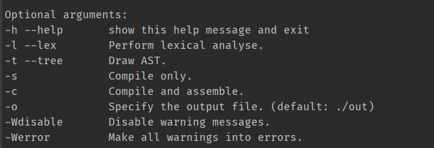

# c0-cli

2019软件学院编译原理大作业

## 编译与使用

1. 运行 `./build.sh` 脚本编译 c0，编译产物位于 `build/c0`

2. 使用方式是命令行运行编译产物 c0：`c0 [-options] input`

    命令行参数如下图

    

    * -l --lex 打印词法分析的结果

    * -t --tree 打印抽象语法树

    * -s 编译并生成指令

    * -c 编译并汇编到虚拟机字节码

    * -o 指定输出文件

    * -Wdisable 关闭 warning 显示

    * -Werror 将 warning 作为 error 来处理（即产生 warning 不会执行到最后）

3. 为了方便个人测试，提供了一个快速运行脚本 `./run.sh`

    使用该脚本的限制：

    * 项目目录在 `/home/c0-cli`

    * 项目根目录中存在 `toolchain/c0-vm-cpp` 虚拟机的可执行文件

    * 执行的 c0 代码位于 `toolchain/in.c0`

    *这些限制是以变量的形式写在脚本开始位置的，可以通过修改脚本开头的变量更改限制*

## 完成度

基础 + 所有扩展

## 文法/语义规则的改写

没有

## 未定义行为

1. 未初始化就使用的变量都会报一个 warning，然后赋值为 0

2. 没有返回语句的分支默认都返回 0 或者 `void`